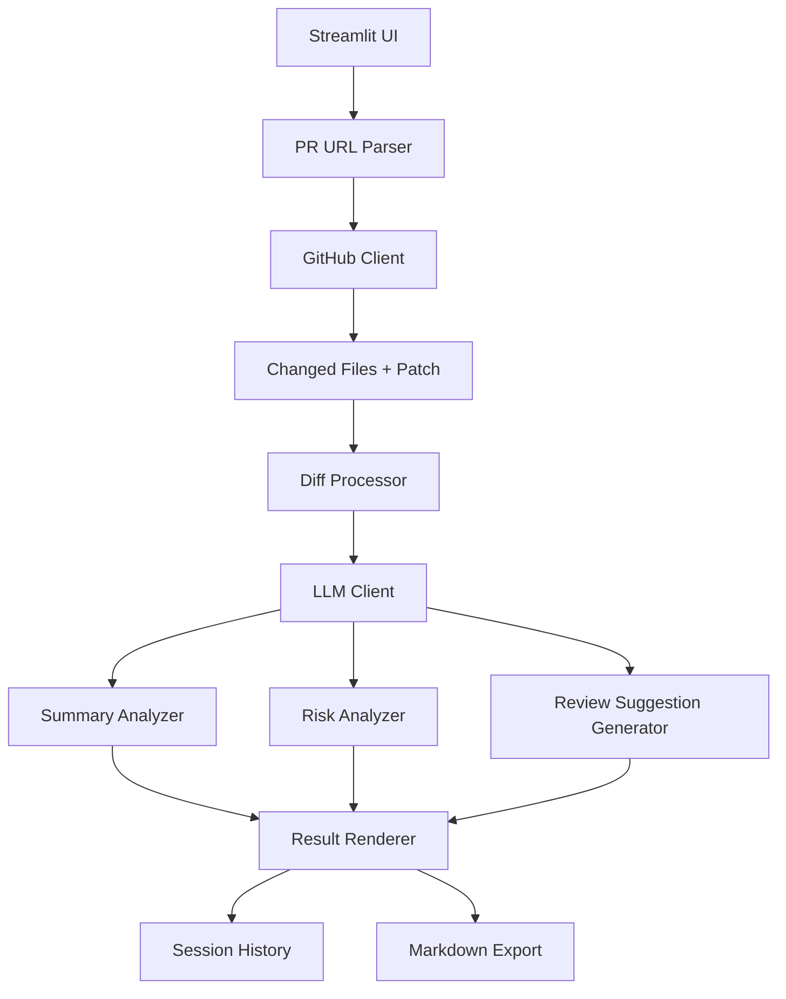

# PRLens：AI PR Review 助手

**Streamlit链接：https://1xengineer-prlens.streamlit.app/**
## 1. 项目概览

PRLens 是一个面向公开 GitHub Pull Request 的轻量级 AI Review 辅助工具。用户输入 PR 链接后，系统会自动获取 PR 基本信息、变更文件和 diff 上下文，并生成：

- **AI 变更总结** — 快速理解 PR 改了什么、为什么改
- **风险分析** — 识别逻辑、边界、异常处理、测试缺失、安全、性能等潜在问题
- **Review 建议** — 结构化、可复制的 Review 评论草稿
- **Markdown 分析报告** — 导出结果用于分享或归档

PRLens 的定位是辅助 Reviewer 更快完成第一轮理解和风险初筛。它**不替代人工 Review**，也**不会向 GitHub 写入评论**。

## 2. 项目背景

- PR 信息分散在标题、描述、文件列表和 diff 中，Reviewer 需要反复切换上下文
- Reviewer 需要花时间理解变更意图和影响范围
- 风险识别受个人经验影响，容易遗漏边界条件、测试缺失和异常处理问题
- AI 生成代码提高了开发速度，也增加了 Review 压力
- 成熟商业工具通常需要团队级集成，轻量体验门槛较高

PRLens 填补了轻量级、低接入成本的 PR 快速审查场景。

## 3. 核心功能

- GitHub PR URL 解析
- GitHub PR 基本信息获取
- changed files 和 patch 获取（分页）
- diff 上下文构建与截断
- AI 变更总结（LLM 生成结构化摘要）
- 风险分析（8 种风险类型：逻辑、边界、异常处理、测试、安全、性能、兼容性、可维护性）
- Review 建议生成（带依据的可复制评论草稿）
- 快速 / 标准 / 完整三种分析模式
- 中文 / English 双语界面与模型输出
- 会话级历史记录（最多 10 条，点击恢复）
- Markdown 报告导出
- 分阶段分析进度反馈
- 分析耗时展示
- 风险分析空响应和非法 JSON fallback

## 4. 产品范围演进

PRD v0.2 是项目初期的产品规划文档。PR1-PR17 开发过程中，根据实现成本、Demo 稳定性和用户体验反馈，对 MVP 范围进行了小幅校准。PRD v0.3 是**最终交付阶段的范围校准版**，用于说明当前产品的实际能力、已实现范围和后续规划。

关键范围调整：

- 主页面示例 PR 快速入口 → 从主流程移除，改为文档记录 Demo 案例
- 风险项反馈按钮 → 后续规划，反馈闭环需持久化存储
- 通用缓存 → 调整为会话级历史记录
- 单一完整分析流程 → 增加快速、标准、完整三种模式
- 静态加载状态 → 增加分阶段进度反馈
- 模型错误直接暴露 → 改为结构化 fallback

详见 [docs/product_evolution.md](docs/product_evolution.md)。

## 5. 演示流程

1. 打开 PRLens 页面
2. 在侧栏选择语言
3. 选择标准模式
4. 输入公开 GitHub PR 链接
5. 点击「开始分析」
6. 查看分阶段进度和耗时
7. 查看 PR 概览和变更文件
8. 查看 diff 上下文统计
9. 阅读 AI 变更总结
10. 查看风险分析
11. 切换到完整模式后生成 Review 建议
12. 从历史记录恢复结果
13. 导出 Markdown 报告

## 6. 分析模式

| 模式 | 执行内容 | 不执行内容 | 适用场景 |
|---|---|---|---|
| 快速模式 | 变更总结 | 风险分析、Review 建议 | 快速了解 PR 做了什么 |
| 标准模式 | 变更总结、风险分析 | Review 建议 | 常规 Review 前的风险初筛 |
| 完整模式 | 变更总结、风险分析、Review 建议 | — | 需要形成评论草稿的场景 |

## 7. 系统架构



## 8. 项目结构

```
.
├── app.py                          # Streamlit 主应用
├── src/
│   ├── pr_parser.py                # GitHub PR URL 解析
│   ├── github_client.py            # GitHub REST API 客户端
│   ├── diff_processor.py           # diff 清洗与上下文构建
│   ├── llm_client.py               # OpenAI-compatible LLM 客户端
│   ├── summary_analyzer.py         # AI 变更总结生成
│   ├── risk_analyzer.py            # 风险识别模块
│   └── review_suggestion.py        # Review 建议生成
├── tests/                          # 测试套件（266 个测试）
├── docs/                           # 产品与交付文档
├── prompts/                        # Prompt 设计文档
├── requirements.txt
├── .env.example
└── README.md
```

## 9. 环境安装

**Windows：**

```bash
python -m venv .venv
.venv\Scripts\activate
pip install -r requirements.txt
```

**macOS / Linux：**

```bash
python -m venv .venv
source .venv/bin/activate
pip install -r requirements.txt
```

## 10. 环境变量

在项目根目录创建 `.env` 文件：

```bash
LLM_API_KEY=your_api_key
LLM_BASE_URL=https://your-openai-compatible-endpoint/v1
LLM_MODEL=your-model-name
GITHUB_TOKEN=optional_github_token
```

- `LLM_API_KEY`、`LLM_MODEL`、`LLM_BASE_URL` 为**必填项**
- `GITHUB_TOKEN` 对公开仓库不是必需项，但可以降低 GitHub API rate limit 风险
- `.env` **不应提交到仓库**
- MVP 阶段不支持完整私有仓库分析

## 11. 启动 Demo

项目已通过 `.streamlit/config.toml` 固定为浅色主题，保证本地和线上部署的视觉一致性。

```bash
streamlit run app.py
```

## 12. 运行测试

```bash
pytest -q
```


## 13. Demo 案例

推荐测试链接：

- https://github.com/octocat/Hello-World/pull/6 — 小型 PR，适合快速演示
- https://github.com/fastapi/fastapi/pull/12000 — 展示风险分析和 fallback

详见 [docs/evaluation_cases.md](docs/evaluation_cases.md)。

## 14. 交付文档

| 文档 | 说明 |
|---|---|
| [docs/prd.md](docs/prd.md) | 最终范围校准版 PRD（v0.3） |
| [docs/prlens_prd_v0.3.md](docs/prlens_prd_v0.3.md) | PRD v0.3 版本归档 |
| [docs/product_evolution.md](docs/product_evolution.md) | 产品范围演进说明 |
| [docs/evaluation_cases.md](docs/evaluation_cases.md) | Demo 验证案例 |
| [docs/demo_script.md](docs/demo_script.md) | 演示讲解稿 |
| [docs/final_submission.md](docs/final_submission.md) | 最终提交检查清单 |
| [docs/known_limitations.md](docs/known_limitations.md) | 已知限制与 Demo 风险 |
| [docs/prlens_product_audit.md](docs/prlens_product_audit.md) | 产品审查报告 |
| [docs/evaluation_report.md](docs/evaluation_report.md) | 测评报告 |
| [docs/evaluation.md](docs/evaluation.md) | 评测体系框架 |
| [prompts/summary_prompt.md](prompts/summary_prompt.md) | 变更总结 Prompt 设计 |
| [prompts/review_prompt.md](prompts/review_prompt.md) | Review Prompt 设计 |
| [prompts/output_schema.md](prompts/output_schema.md) | 模型输出 Schema |

## 15. 已知限制

- MVP 仅支持公开 GitHub PR
- 不向 GitHub 写入评论
- 分析仅基于 PR 标题、描述、变更文件和 diff
- 可能遗漏完整仓库上下文、运行时行为和隐藏依赖
- 不运行测试，不编译代码
- 长 diff 会触发截断
- LLM 输出需要人工确认
- 会话历史仅保存在当前 Streamlit session 中，刷新或重启后不保留

## 16. 产品定位

PRLens 不定位为 GitHub Copilot Code Review、CodeRabbit 或 Qodo 这类企业级 AI Code Review 平台的替代品。

它的定位是：面向公开 GitHub PR 的**轻量级 Review 辅助工具**，帮助用户用较低接入成本快速完成 PR 理解、风险初筛和 Review 建议整理。

