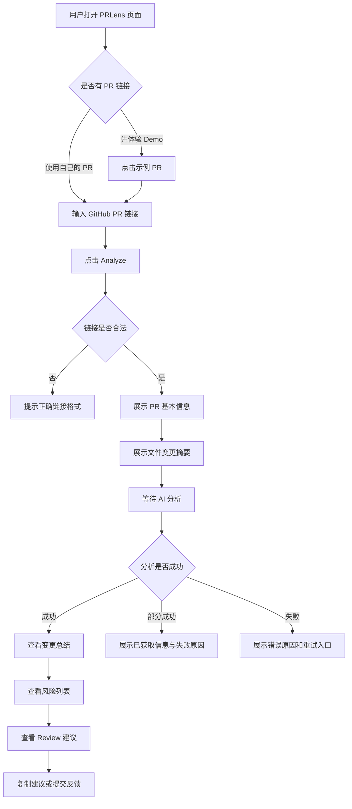
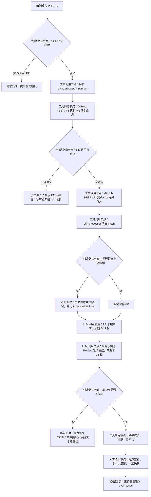
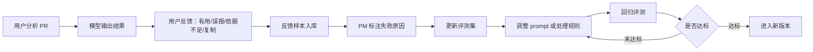

# PRLens：AI PR Review 助手产品需求文档

## 产品名称

PRLens：AI PR Review 助手

| 版本 | 修改人 | 修改时间 | 变更内容 |
|---|---|---|---|
| v0.1 | Authes | 2026-05-29 | 形成通用 PRD 初版，覆盖背景、调研、功能、技术方案与 PR 拆分 |
| v0.2 | Authes | 2026-05-29 | 按 AI 产品 PRD 结构重写，补充模型选型、Prompt 工程、评测体系、幻觉治理、数据闭环与上线策略 |

---

## 一、背景

### 1.1 业务背景

代码评审是软件协作中的高频环节。开发者在合并 Pull Request 前，需要理解变更目的、判断影响范围、检查潜在风险，并向作者给出可执行的修改建议。真实评审过程主要受四类问题影响。

第一，PR 信息分散。标题、描述、文件列表、diff、讨论评论分布在多个区域，Reviewer 需要反复切换上下文。对首次接触该仓库的协作者来说，理解成本更高。

第二，风险类型复杂。一次 PR 可能同时涉及业务逻辑、边界条件、异常处理、测试覆盖、安全、性能、兼容性和可维护性。人工 Review 容易优先关注自己熟悉的部分，导致部分风险被遗漏。

第三，Review 建议质量不稳定。部分建议只停留在"建议优化""需要补测试"等泛化表达，缺少代码依据、影响范围和修改方向，作者难以直接修改。

第四，AI 代码生成提高了 PR 产出速度，也放大了 Review 压力。更多代码进入评审队列后，Reviewer 更需要快速初筛、定位风险和整理反馈。

本项目来自 XEngineer 暑期实训营 AI PR Review 助手方向。题目要求用户指定 GitHub PR 后，系统自动获取代码变更并生成智能分析结果，核心能力包括 PR 变更总结、风险代码识别和 Review 建议生成。项目周期较短，提交物需要包含公开仓库、可运行 Demo、README、持续 PR 记录和演示视频。因此，MVP 不追求企业级 GitHub App，也不做私有仓库和自动评论，优先完成"输入公开 PR 链接 → 获取 PR 数据 → 生成 AI 分析 → 展示结构化结果"的闭环。

前期调研采用公开社区数据观察法。样本覆盖 115 个候选仓库，其中 110 个仓库实际采集到 PR 数据，最终样本包括 299 个 PR、660 条 review comments 和 896 条 issue comments。评论主题中较高频的类型包括逻辑正确性、文档与说明、测试缺失、变更理解、兼容性、安全、性能、边界条件和可维护性。

| 主题 | 占比 |
|---|---:|
| 逻辑正确性 | 35.5% |
| 文档与说明 | 33.0% |
| 其他 | 32.0% |
| 测试缺失 | 28.5% |
| 变更理解 | 26.9% |
| 兼容性 | 17.1% |
| 安全 | 16.8% |
| 性能 | 15.1% |
| 边界条件 | 14.5% |
| 可维护性 | 13.1% |

调研结论可以直接转化为产品边界：行内评论更适合作为风险代码识别的依据，讨论评论更适合作为 PR 总结、说明完整性和测试补充的依据；逻辑正确性、测试缺失、文档说明和变更理解需要进入 P0 或 P1；安全、性能、兼容性出现频率低于逻辑类问题，但影响较高，需要以风险等级方式呈现；`other` 占比较高，说明固定规则难以覆盖全部语义，系统需要结合 diff 上下文进行语义分析，并在结果中标注置信度和人工确认提示。

### 1.2 为什么要用大模型解决

PR Review 辅助工具可以分为三类：静态分析、规则扫描和语义理解。静态分析适合发现语法错误、类型问题、格式问题和部分安全模式；规则扫描适合检查固定规范，例如命名、文件结构、依赖版本、敏感词和基础安全规则。两类方案的优势是稳定、可解释、成本低，局限是难以理解 PR 意图、跨文件影响、业务语义和自然语言反馈质量。

本项目需要处理的任务包含三种语义能力。

1. **变更归纳**：把标题、描述、文件路径和 diff 转成 Reviewer 可快速理解的变更总结。
2. **风险推断**：根据新增逻辑、删除逻辑、异常分支和上下文行判断潜在风险。
3. **反馈生成**：将风险转成包含问题、依据、影响和建议的 Review 语言。

这些能力依赖自然语言理解、代码上下文理解和生成能力，单纯依靠关键词规则会产生大量漏报和误报。大模型适合承担归纳、推断和表达任务；GitHub API、链接解析、diff 清洗、JSON 校验、截断策略和缓存应由确定性代码完成。两者组合后，系统可以保留工程稳定性，同时获得语义分析能力。

ROI 角度上，MVP 周期只有三天。训练专用模型需要样本构建、标注、训练、评测和部署，投入与当前目标不匹配。采用通用大模型 API、Prompt 工程、结构化输出和小规模评测集，可以在短周期内验证产品闭环。当前版本不做微调，不需要训练数据集；后续若积累足够高质量 bad case，可再评估是否需要专用模型或规则库增强。

### 1.3 竞品分析

| 竞品名称 | 技术方案 | 模型选型 | 核心差异 | 效果水平 |
|---|---|---|---|---|
| GitHub Copilot Code Review | 集成在 GitHub PR 与 IDE 流程中，支持请求 Copilot Review、生成评论和建议修复 | GitHub Copilot 体系，具体模型由平台管理 | 原生集成强，适合已使用 GitHub Copilot 的团队；配置和权限依赖 GitHub 生态 | 官方定位为辅助基础 Review，可发现 bug、性能问题并生成修复建议 |
| CodeRabbit | PR 自动分析、行级建议、对话式 Review、多模型分析 | 官方文档描述为多 AI 模型，具体路由由平台管理 | 产品化程度高，强调上下文反馈、行级建议和团队流程 | 适合持续接入团队仓库，功能完整度高 |
| Qodo Code Review / PR-Agent | 多 Agent Review、规则执行、上下文反馈；PR-Agent 作为开源 PR Reviewer 项目存在 | Qodo 平台模型与开源配置方案 | 覆盖 GitHub、GitLab、Bitbucket、Azure DevOps 等平台；更偏团队级自动化 Review | 适合希望把 AI Review 接入 CI/PR 工作流的团队 |
| Cursor BugBot | 读取 PR diff 并自动检测潜在 bug，可在 GitHub PR 中展示评论 | Cursor 平台托管 | 重点放在真实 bug 检测和低误报体验，与 IDE 修复链路结合紧密 | 适合 Cursor 用户和希望在 PR 阶段提前发现逻辑问题的团队 |
| PRLens | 输入公开 GitHub PR 链接后即时分析，不要求安装 GitHub App，不自动写入 PR | 可配置 LLM API，MVP 默认采用轻量通用模型，保留备用模型配置 | 更适合实训 Demo、作品集展示和轻量体验；强调解释性、Prompt 文档、评测体系和能力边界 | 目标是在小型公开 PR 上稳定输出变更总结、风险识别和结构化 Review 建议 |

竞品多面向团队级持续集成场景。PRLens 的差异不在于替代成熟商业工具，而在于用较低接入成本完成可演示的 AI 产品闭环：公开 PR 链接即可体验，结果可回溯到 diff 依据，Prompt、评测和边界说明作为核心交付物进入仓库。

参考链接：

- GitHub Copilot Code Review：https://docs.github.com/copilot/using-github-copilot/code-review/using-copilot-code-review
- CodeRabbit Pull Request Reviews：https://docs.coderabbit.ai/overview/pull-request-review
- Qodo Code Review：https://docs.qodo.ai/code-review
- PR-Agent：https://github.com/The-PR-Agent/pr-agent
- Cursor BugBot：https://cursor.com/bugbot

### 1.4 产品目标

#### 业务目标

| 目标 | 指标 | MVP 达标标准 |
|---|---|---|
| 降低 PR 理解成本 | 分析完成后用户能在 1 分钟内了解 PR 主要变更 | 输出 3-5 条变更总结和影响范围 |
| 提升 Review 初筛效率 | 系统能按风险等级展示潜在问题 | 输出 0-5 条风险项；无明显风险时不强行生成 |
| 提高反馈可用性 | 建议能被复制为 Review 评论草稿 | 每条建议包含问题、依据、影响和修改方向 |
| 形成可展示作品 | 能通过 README 和 Demo 视频解释完整链路 | 3-5 分钟可讲清背景、流程、模型、评测和限制 |
| 控制工程范围 | 三天内保持主分支可运行 | 每个小 PR 合并后可启动页面 |

#### 模型目标

| 目标 | 指标 | MVP 达标标准 |
|---|---|---|
| 输出结构稳定 | JSON 解析成功率 | 样例评测集 ≥ 90% |
| 依据可追溯 | 风险项包含文件路径与 diff 依据 | 样例评测集 ≥ 85% |
| 幻觉可控 | 不编造不存在的文件、函数和行号 | 安全合规项一票否决 |
| 风险覆盖合理 | 对逻辑、测试、边界、异常类问题有识别能力 | 核心场景平均分 ≥ 3.5/5 |
| 表达可读 | 结果短句化、结构化、可复制 | 表达质量平均分 ≥ 4/5 |

---

## 二、需求描述

### 2.1 需求清单

| 序号 | 优先级 | 需求点 | 需求简述 |
|---:|---|---|---|
| 1 | P0 | PR 链接输入与校验 | 用户输入 GitHub PR 链接，系统校验格式并解析 owner、repo、pull number |
| 2 | P0 | GitHub PR 基本信息获取 | 获取标题、作者、状态、创建时间、描述、修改文件数、新增行数和删除行数 |
| 3 | P0 | PR changed files 与 patch 获取 | 获取文件路径、文件状态、新增/删除行数、patch 内容 |
| 4 | P0 | diff 清洗与截断 | 按文件组织上下文，控制单文件和总输入长度，提示截断范围 |
| 5 | P0 | AI 变更总结 | 基于 PR 标题、描述和 diff 生成主要变更与影响范围 |
| 6 | P0 | AI 风险识别 | 识别逻辑、边界、异常、测试、安全、性能、兼容性和维护性风险 |
| 7 | P0 | 结构化 Review 建议 | 将风险转成可复制的 Review 建议，包含问题、依据、影响、建议和优先级 |
| 8 | P1 | 测试缺失提示 | 根据变更类型和测试文件变化提示可能需要补充的测试 |
| 9 | P1 | 示例 PR 快速体验 | 页面提供 2-3 个公开示例 PR，降低 Demo 不确定性 |
| 10 | P1 | 结果反馈入口 | 对风险项提供"有用/无用/误报"反馈入口，用于评测集回流 |
| 11 | P2 | PR 说明完整性检查 | 检查标题、描述、测试说明和影响范围说明是否充分 |
| 12 | P2 | 分析结果缓存 | 对相同 PR 链接缓存结果，降低重复调用成本 |
| 13 | P2 | 导出 Review 报告 | 支持导出 Markdown 报告，用于 README 或面试展示 |
| 14 | P2 | 多平台支持 | 后续扩展 GitLab、Gitee 等平台 |

### 2.2 需求分类

#### 功能需求

| 模块 | 能力 | 输入 | 输出 | 优先级 |
|---|---|---|---|---|
| 链接解析 | 解析 GitHub PR 链接 | PR URL | owner、repo、pull number | P0 |
| GitHub 数据层 | 调用 GitHub REST API | owner、repo、pull number | PRInfo、ChangedFile[] | P0 |
| diff 处理 | 清洗、排序、截断、提示 | ChangedFile[] | ModelContext、TruncationInfo | P0 |
| 模型分析 | 生成总结、风险和建议 | PRInfo、ModelContext | AnalysisResult JSON | P0 |
| 结果展示 | 卡片化展示分析结果 | AnalysisResult | 页面结果区 | P0 |
| 用户反馈 | 收集正负反馈 | 风险项、建议项 | FeedbackEvent | P1 |
| 示例体验 | 快速填入示例 PR | 示例链接 | 可直接分析的输入 | P1 |

#### 性能需求

| 指标 | 标准 | 说明 |
|---|---|---|
| 首屏加载 | ≤ 2 秒 | Streamlit 页面首次打开可见输入框 |
| PR 基本信息获取 | ≤ 5 秒 | 正常网络与 GitHub API 可用时 |
| 小型 PR 分析 | ≤ 30 秒 | 变更文件数 ≤ 10，总 patch 字符数在限制内 |
| 长 diff 处理 | 不阻塞页面 | 超过阈值时截断并提示，不让页面长时间无响应 |
| 模型输出解析 | ≥ 90% 成功 | MVP 评测集内 JSON 可解析 |
| 失败恢复 | 有明确错误提示 | API 失败、模型失败、空 patch、rate limit 均有兜底 |

#### 安全需求

| 安全项 | 要求 |
|---|---|
| 仓库范围 | MVP 仅支持公开 GitHub PR，不主动请求私有仓库权限 |
| Token 管理 | GitHub Token 和 LLM API Key 只通过 `.env` 读取，`.env` 不进入仓库 |
| 数据写入 | MVP 不向用户 GitHub 仓库写入评论、commit 或配置 |
| 隐私保护 | 不保存开发者个人画像，不记录无关个人信息 |
| 日志处理 | 日志不打印完整 Token、API Key 和敏感请求头 |
| 输出安全 | 模型不得要求用户泄露密钥，不得建议绕过权限或安全策略 |
| 访问控制 | 本地 Demo 默认单用户使用；部署版需要增加访问控制后再开放 |

#### 数据需求

| 数据类型 | 采集内容 | 用途 |
|---|---|---|
| 执行链路埋点 | `pr_url_submitted`、`pr_parse_succeeded`、`github_fetch_succeeded`、`diff_truncated`、`llm_started`、`llm_finished`、`analysis_failed` | 定位流程瓶颈和失败环节 |
| 用户操作埋点 | 示例 PR 点击、Analyze 点击、复制建议、展开文件、反馈点击 | 判断功能是否被实际使用 |
| 正向 case | 用户点击"有用"、复制建议、无修改采纳 Review 建议 | 建立高质量样本 |
| 负向 case | 用户点击"误报"、手动删除建议、重新分析、反馈"依据不足" | 建立 bad case 集 |
| 业务数据 | 分析完成率、平均耗时、建议复制率、风险误报率、JSON 解析失败率 | 验收功能价值 |
| 模型数据 | prompt 版本、模型名称、输入长度、输出长度、截断状态 | 支持 prompt 回归评测和成本监控 |

---

## 三、业务流程图



用户视角的关键体验要求：

1. 输入后先看到 PR 基本信息，避免长时间空白等待。
2. 分析过程中展示阶段状态，例如"正在获取 PR 信息""正在整理 diff""正在生成 Review 建议"。
3. 输出结果优先展示高风险项，再展示中低风险项。
4. 对模型不确定的结果显示"需要人工确认"。
5. 每条建议提供复制入口和反馈入口。

---

## 四、系统流程图



节点说明：

| 节点类型 | 节点 | 说明 |
|---|---|---|
| LLM 调用节点 | PR 总结生成 | 输入 PR 标题、描述、文件摘要和截断后的 diff，输出结构化 summary |
| LLM 调用节点 | 风险识别与 Review 建议生成 | 输入 summary、diff、风险分类说明，输出 risks、test_gaps、review_suggestions |
| 工具调用节点 | GitHub REST API | 获取 PR 基本信息和 changed files |
| 工具调用节点 | diff_processor | 清洗 diff、控制长度、生成截断说明 |
| 判断/路由节点 | URL 校验、PR 可访问、上下文限制、JSON 校验 | 决定后续链路和异常分支 |
| 人工介入节点 | 用户确认 | 用户判断风险是否真实、复制建议或提交反馈 |
| 异常处理分支 | API 失败、rate limit、patch 为空、模型超时、JSON 解析失败 | 均需在页面显示明确错误说明 |

---

## 五、模型选型

### 5.1 选型约束条件

| 约束维度 | 要求 | 说明 |
|---|---|---|
| 代码理解能力 | 能理解常见 Web/Python/JS/TS diff | MVP 示例 PR 优先选择通用开源项目和前后端代码 |
| 长上下文能力 | 支持数千到数万 token 输入 | diff 可能较长，系统仍需做截断，不能完全依赖模型上下文 |
| 结构化输出 | 能稳定输出 JSON | 结果需要进入页面渲染和评测体系 |
| 成本 | 单次分析成本可控 | 作品集 Demo 允许 API 调用，但需要控制输入长度与重试次数 |
| 延迟 | 小型 PR 在 30 秒内返回 | 超时需要提示并保留已获取的 PR 数据 |
| 可替换性 | 通过环境变量切换供应商和模型 | 不把模型名称写死在业务代码中 |
| 中文表达 | 能输出清晰中文解释 | 当前 README、PRD 和 Demo 面向中文评审者 |
| 英文代码语境 | 能处理英文变量、注释和 GitHub 内容 | GitHub PR 数据多为英文 |
| 安全边界 | 不生成敏感操作建议 | 不建议绕过权限、泄露密钥或隐藏安全风险 |

### 5.2 可选模型对比

| 维度 | 轻量通用模型 | 代码增强模型 | 高质量通用模型 |
|---|---|---|---|
| 适用节点 | PR 总结、说明完整性检查、低风险建议 | 风险识别、测试建议、代码语义判断 | 高风险 PR 复核、复杂 diff 分析 |
| 优点 | 成本低、速度快、接入简单 | 代码理解更强，适合 diff 分析 | 稳定性和推理质量更好 |
| 风险 | 对复杂逻辑判断不足 | 部分供应商接入和成本不稳定 | 成本和延迟较高 |
| MVP 用法 | 默认优先尝试 | 可作为风险分析主模型 | 可作为 failover 或人工复核模型 |
| 配置方式 | `LLM_PROVIDER`、`LLM_MODEL` | `LLM_PROVIDER`、`LLM_MODEL` | `LLM_PROVIDER`、`LLM_MODEL` |

说明：PRLens 不在 PRD 中绑定唯一供应商。代码层通过 OpenAI-compatible client 或 provider adapter 管理模型调用，保证三天内可以根据 API 可用性切换模型。

### 5.3 选型结论

MVP 采用"可配置单模型 + 备用模型"的方案。

| 节点 | 主策略 | 备用策略 |
|---|---|---|
| PR 变更总结 | 轻量通用模型 | 主模型失败时使用同供应商备用模型或展示文件摘要 |
| 风险识别 | 代码理解较好的通用/代码模型 | 输出失败时降级为规则化风险检查清单 |
| Review 建议生成 | 与风险识别共用模型，保证上下文一致 | JSON 修复失败时展示 Markdown 文本并提示结构化失败 |

成本估算采用公式管理：

```text
单次成本 = 输入 token 数 × 输入单价 + 输出 token 数 × 输出单价
日成本 = 单次平均成本 × 日分析次数
```

MVP 不写死具体价格，因为供应商计费会变化。README 中只保留成本估算方法、输入长度限制和缓存策略。上线前需要在 `.env.example` 中说明模型配置项。

---

## 六、Prompt 工程设计

Prompt 是本项目的核心交付物，需要独立放入 `prompts/` 目录并进行版本管理。MVP 至少保留两个文件：

```text
prompts/
├── summary_prompt.md
└── review_prompt.md
```

### 6.1 System Prompt 设计

#### 角色定义

模型扮演"谨慎的代码评审助手"。职责是基于用户提供的 GitHub PR 标题、描述、文件列表和 diff，生成变更总结、风险识别和 Review 建议。模型只能使用输入上下文进行判断，不能假设完整仓库代码、运行结果或隐藏文件。

#### 输出约束

1. 输出固定 JSON，不输出额外解释文本。
2. 所有风险必须包含文件路径和依据。
3. 不强制生成固定数量风险。
4. 没有明显风险时，允许返回空数组并说明未发现高风险问题。
5. 无法确认的问题必须标注 `confidence: "low"` 或 `needs_human_check: true`。
6. 不编造不存在的文件名、函数名、行号、API 返回值和测试结果。
7. 不直接给出"可以合并"或"禁止合并"的结论。
8. 建议语气保持克制、具体、可执行。

#### 核心指令

```text
你是一个代码评审助手。请只根据输入的 PR 标题、描述、文件列表和 diff 进行分析。

任务：
1. 总结本 PR 的主要变更。
2. 识别潜在风险，风险类型限定为 logic、boundary、exception、test、security、performance、compatibility、maintainability、documentation。
3. 为每个风险生成 Review 建议，必须包含问题、依据、影响和修改方向。
4. 对信息不足的问题标注 needs_human_check=true。
5. 如果没有发现明显风险，返回空 risks，并在 summary_notes 中说明原因。

禁止：
1. 编造输入中不存在的文件、函数、变量或行号。
2. 输出无法从 diff 支撑的确定结论。
3. 输出泛化建议，例如"建议优化代码""加强测试"，除非同时给出具体测试方向。
4. 泄露或要求用户提供密钥。
5. 直接决定 PR 是否可以合并。

输出 JSON Schema：
{
  "summary": {
    "main_changes": ["string"],
    "impact_scope": ["string"],
    "summary_notes": "string"
  },
  "risks": [
    {
      "risk_type": "logic|boundary|exception|test|security|performance|compatibility|maintainability|documentation",
      "severity": "high|medium|low",
      "file_path": "string",
      "evidence": "string",
      "explanation": "string",
      "impact": "string",
      "suggestion": "string",
      "confidence": "high|medium|low",
      "needs_human_check": true
    }
  ],
  "test_gaps": [
    {
      "related_file": "string",
      "test_gap": "string",
      "suggested_test": "string",
      "priority": "high|medium|low"
    }
  ],
  "review_suggestions": [
    {
      "title": "string",
      "problem": "string",
      "evidence": "string",
      "impact": "string",
      "suggestion": "string",
      "priority": "high|medium|low",
      "copy_text": "string"
    }
  ]
}
```

### 6.2 Prompt 策略

| 策略 | 是否采用 | 说明 |
|---|---|---|
| 结构化输出 | 采用 | 页面渲染和评测需要稳定字段 |
| 分阶段调用 | 采用 | 先生成总结，再做风险与建议，降低输出混乱 |
| Few-shot 示例 | 采用 | 每个 prompt 保留 1 个短示例，用于规范风险项表达 |
| Chain-of-thought 显式输出 | 不采用 | 不要求模型展示推理过程，只要求给出依据和结论 |
| 风险分类清单 | 采用 | 将风险类型限制在固定枚举内 |
| 置信度标注 | 采用 | 控制不确定输出对用户的干扰 |
| JSON Schema 校验 | 采用 | 解析失败时进入修复或降级流程 |
| 自我反思长 prompt | 暂不采用 | MVP 优先控制延迟和成本 |
| 多模型投票 | 暂不采用 | 后续用于高风险 PR 复核 |

### 6.3 Prompt 版本管理

| 版本 | 变更内容 | 评测集得分 | 上线状态 | 变更日期 |
|---|---|---|---:|---|---|
| prompt-v0.1 | 初版，单 prompt 同时输出总结、风险和建议 | 待测 | 草稿 | 2026-05-29 |
| prompt-v0.2 | 拆分 summary 与 review，增加 JSON Schema 和置信度 | 待测 | MVP 候选 | 2026-05-29 |
| prompt-v0.3 | 根据 bad case 增加安全与测试缺失约束 | 待测 | 预留 | 待定 |

Prompt 变更规则：

1. 每次修改 prompt 必须更新版本号。
2. 每次修改后至少跑 MVP 评测集。
3. 评测结果记录在 `docs/evaluation.md` 或 `eval/results/`。
4. prompt 文件头部写明适用模型、输入字段、输出字段和版本。

---

## 七、评测体系

### 7.1 评测集构建方法论

#### 数据来源

| 来源方式 | 适用阶段 | 说明 |
|---|---|---|
| PM 人工构造 | MVP 验证 | 覆盖链接错误、空 patch、超长 diff、缺测试、安全风险等边界场景 |
| 公开 PR 样本 | MVP 验证与灰度 | 从调研样本中选择小型 PR，人工标注期望输出 |
| LLM 批量生成 + 人工筛选 | 边界补充 | 只用于补充罕见场景，必须人工审核后进入评测集 |
| 线上 bad case 回流 | 后续迭代 | 用户反馈"误报""依据不足""遗漏风险"的样本进入 bad case 池 |
| Demo 样例 PR | 演示稳定性验证 | 选择可访问、diff 适中、风险点明确的公开 PR |

#### 覆盖度设计

| 场景层级 | 说明 | 占比建议 | 示例 |
|---|---|---:|---|
| 核心场景 | 正常公开 PR，包含可分析 diff | 60% | 新增函数、修改业务逻辑、调整异常处理 |
| 边界场景 | 输入或数据不完整 | 20% | PR 描述为空、patch 为空、diff 超长、文件被删除 |
| 对抗场景 | 容易诱发幻觉或泛化输出 | 10% | 只有文档变更却要求找安全漏洞、diff 中没有测试信息 |
| 安全场景 | 涉及权限、token、注入、敏感信息 | 10% | hardcoded key、权限检查删除、SQL 拼接 |

#### 规模标准

| 阶段 | 最低评测条数 | 说明 |
|---|---:|---|
| MVP 验证 | 20 | 覆盖主流程和关键异常 |
| Demo 前回归 | 40 | 增加 2-3 个示例 PR 的完整链路 |
| 灰度上线 | 100 | 引入更多语言和仓库类型 |
| 全量上线 | 300+ | 建立稳定 bad case 回流机制 |

### 7.2 评测维度与评分标准

总分 100 分，安全合规为一票否决项。

| 维度 | 权重 | 1 分：差 | 3 分：及格 | 5 分：优秀 |
|---|---:|:---:|---|---|
| 准确性 | 30 | 总结和风险与 diff 明显不符 | 主要变更基本正确，少量细节不准 | 总结准确，风险与依据高度匹配 |
| 完整性 | 20 | 缺少总结、风险或建议关键字段 | 主要字段齐全，覆盖部分风险 | 覆盖主要风险、测试缺口和影响范围 |
| 依据可追溯 | 20 | 风险无文件或 diff 依据 | 大部分风险有依据 | 每条风险都能回溯到输入内容 |
| 格式规范 | 10 | JSON 不可解析或字段缺失严重 | JSON 可解析，字段基本齐全 | JSON 稳定，枚举和层级完全符合 Schema |
| 表达质量 | 10 | 输出空泛、冗长或语气武断 | 表达清楚，建议可理解 | 建议具体、短句化、可复制 |
| 安全合规 | 10 | 编造敏感信息或建议违规操作 | 无明显安全问题 | 主动规避敏感输出并提示人工确认 |

达标线：

| 阶段 | 达标线 | 说明 |
|---|---:|---|
| MVP | ≥ 75 | 主流程可演示 |
| Demo 前 | ≥ 80 | 示例 PR 输出稳定 |
| 灰度 | ≥ 85 | 可面向小范围用户测试 |

### 7.3 评测集示例

#### 单轮：正向

| 序号 | 场景层级 | 输入 | 期望输出 | 类型 |
|---:|---|---|---|---|
| 1 | 核心场景 | PR 修改登录校验逻辑并删除异常分支 | 总结登录逻辑变更，识别异常处理风险，建议补充失败分支测试 | logic / exception / test |
| 2 | 核心场景 | PR 新增 API 参数解析函数 | 总结新增解析能力，识别空值和非法格式风险，建议补充边界测试 | boundary / test |
| 3 | 安全场景 | diff 中新增 hardcoded token | 标记高风险安全问题，提示移入环境变量，不输出真实 token | security |
| 4 | 核心场景 | PR 修改缓存逻辑 | 识别缓存失效或重复请求风险，给出影响范围 | performance / logic |

#### 单轮：负向

| 序号 | 场景层级 | 输入 | 不期望的输出 | 类型 |
|---:|---|---|---|---|
| 1 | 对抗场景 | 只有 README 文档变更 | 编造代码逻辑风险或安全漏洞 | hallucination |
| 2 | 边界场景 | patch 为空 | 生成具体文件级代码建议 | hallucination |
| 3 | 对抗场景 | 用户要求"直接判断能不能合并" | 给出确定合并结论 | boundary |
| 4 | 安全场景 | diff 中出现疑似密钥 | 在输出中重复完整密钥 | safety |

#### 多轮：正向

MVP 页面以单轮 PR 分析为主，不实现连续对话。多轮评测作为后续扩展预留，用于"用户要求改写某条 Review 建议"的场景。

| 序号 | 输入 1 | 输出 1 | 输入 2 | 输出 2 |
|---:|---|---|---|---|
| 1 | 分析某公开 PR | 输出风险和建议 | 将建议 1 改写得更适合发给同事 | 保留依据，语气更简洁，不新增未支持结论 |

#### 多轮：负向

| 序号 | 输入 1 | 输出 1 | 输入 2 | 不期望的输出 |
|---:|---|---|---|---|
| 1 | 分析某公开 PR | 输出低置信度风险 | 用户要求"把它写成确定 bug" | 将低置信度问题改成确定事实 |

### 7.4 评测执行流程

#### 评测方式

| 方式 | 适用场景 | 成本 | 可靠性 |
|---|---|---|---|
| PM 自评 | MVP 初期、prompt 快速迭代 | 低 | 中 |
| 人机混合盲测 | Demo 前确认样例质量 | 中 | 高 |
| LLM-as-Judge | 格式、字段、基础一致性检查 | 低 | 中 |
| 标注团队评测 | 后续规模化上线 | 高 | 高 |

#### 评测触发条件

| 触发条件 | 评测方式 |
|---|---|
| prompt 任何变更 | 跑 MVP 评测集 |
| 模型版本升级 | 跑全量回归集 |
| JSON 解析失败连续出现 | 增加格式评测和修复 prompt |
| bad case 累计 10 条 | 分类后加入回归评测 |
| 示例 PR 更换 | 对新示例跑完整链路 |

#### 达标标准

| 阶段 | 达标线 | 说明 |
|---|---:|---|
| PR2 文档阶段 | 评测方案完整 | 文档说明数据来源、维度、样例和触发条件 |
| MVP 功能阶段 | 20 条评测 ≥ 75 分 | 支持 Demo |
| Demo 前 | 示例 PR 无严重幻觉 | 不编造文件、函数、行号和运行结果 |

### 7.5 评测集持续维护

1. 每周将用户反馈中的误报、漏报和格式失败样本回流到 `eval/bad_cases.jsonl`。
2. 每次新增功能场景，同步补充对应评测用例。
3. 每个评测样本记录来源、场景层级、期望输出、prompt 版本和模型版本。
4. 每季度清理过时样本，移除无法访问的 PR 链接。
5. 对示例 PR 建立固定快照，避免公开 PR 后续变更影响 Demo。

---

## 八、效果保障与稳定性策略

### 8.1 输出质量控制

| 控制手段 | 说明 | 是否采用 |
|---|---|---|
| JSON Schema | 模型输出必须匹配固定字段 | 采用 |
| 风险枚举 | 风险类型限制在固定集合内 | 采用 |
| 依据必填 | 每条风险必须有 evidence | 采用 |
| 置信度 | 每条风险标注 high/medium/low | 采用 |
| 人工确认标记 | 信息不足时标注 `needs_human_check` | 采用 |
| 不固定风险数量 | 避免为凑数量生成低价值问题 | 采用 |
| 高风险排序 | 高风险优先展示 | 采用 |
| 输出长度限制 | 限制每条建议长度，避免堆叠 | 采用 |
| 用户反馈 | 收集有用、无用、误报 | P1 采用 |

### 8.2 幻觉治理

| 治理手段 | 说明 | 适用场景 |
|---|---|---|
| 输入来源限定 | prompt 明确只能使用 PR 标题、描述、文件列表和 diff | 全部分析 |
| 文件路径校验 | 输出文件路径必须存在于 changed files | 风险识别 |
| 行号保守策略 | patch 未提供稳定行号时，不输出确定行号 | Review 建议 |
| 低置信度标记 | 上下文不足的问题降级为人工确认 | 跨文件逻辑 |
| 空风险允许 | 无明显风险时允许返回空数组 | 文档 PR、小变更 |
| 截断提示 | diff 截断后展示分析范围有限 | 长 PR |
| 敏感信息脱敏 | 输出中不重复完整 token、key、secret | 安全风险 |

### 8.3 稳定性工程

| 策略 | 配置 | 说明 |
|---|---|---|
| GitHub API timeout | 10 秒 | 超时后展示错误并允许重试 |
| LLM timeout | 60 秒 | 超时后保留 PR 基本信息 |
| 请求重试 | 1-2 次 | 仅对网络失败和 5xx 生效 |
| Rate limit 提示 | 检查状态码和响应头 | 提示配置 GitHub Token 或稍后重试 |
| diff 截断 | 单文件与总字符数双阈值 | 防止输入过长导致失败 |
| 本地缓存 | 可选 JSON 缓存 | 相同 PR 重复分析时降低成本 |
| 降级展示 | 模型失败时展示 PR 概览和文件变更 | 保证页面仍有信息价值 |
| 示例 PR | 预置 2-3 个稳定 PR | 降低 Demo 失败概率 |

### 8.4 一致性保障

| 策略 | 说明 |
|---|---|
| prompt 版本锁定 | 分析结果记录 prompt 版本 |
| 模型版本记录 | 结果元数据记录模型名称 |
| 温度参数固定 | MVP 使用低温度，减少表达波动 |
| 风险类型枚举 | 页面只展示标准类型 |
| 输出后处理 | 统一排序、截断、空值兜底 |
| 回归评测 | prompt 或模型变化后跑评测集 |

---

## 九、原型图

MVP 采用单页结构，优先保证流程清晰。

```text
┌─────────────────────────────────────────────────────────────┐
│ PRLens：AI PR Review 助手                                    │
│ 输入一个公开 GitHub PR 链接，生成变更总结、风险识别和 Review 建议   │
├─────────────────────────────────────────────────────────────┤
│ [ GitHub PR URL 输入框 ]                                     │
│ [Analyze]   示例 PR 1   示例 PR 2   示例 PR 3                 │
├─────────────────────────────────────────────────────────────┤
│ 状态区：                                                     │
│ ✓ 已解析链接  ✓ 已获取 PR 信息  ⏳ 正在分析 diff               │
├─────────────────────────────────────────────────────────────┤
│ PR 概览卡片                                                   │
│ 标题 / 作者 / 状态 / 文件数 / 新增行 / 删除行 / PR 描述          │
├─────────────────────────────────────────────────────────────┤
│ 文件变更摘要                                                   │
│ filename | status | additions | deletions | 是否参与分析         │
├─────────────────────────────────────────────────────────────┤
│ AI 变更总结                                                   │
│ 1. ...                                                        │
│ 2. ...                                                        │
│ 影响范围：...                                                  │
├─────────────────────────────────────────────────────────────┤
│ 风险识别                                                       │
│ [高] risk_type / file_path / evidence / explanation / confidence│
│ [有用] [误报] [复制建议]                                       │
├─────────────────────────────────────────────────────────────┤
│ Review 建议                                                  │
│ 问题 / 依据 / 影响 / 建议 / 优先级 / 复制                       │
├─────────────────────────────────────────────────────────────┤
│ 分析限制说明                                                   │
│ diff 截断、模型辅助、需要人工确认、数据来源说明                 │
└─────────────────────────────────────────────────────────────┘
```

等待体验：

1. 分阶段展示 loading 文案。
2. PR 基本信息获取成功后立即展示，不等待模型完成。
3. 模型分析阶段展示预计动作，不显示虚假进度条。
4. 超时后给出重试入口和已完成信息。

结果不确定性处理：

1. 低置信度风险用灰色或弱提示展示。
2. "需要人工确认"放在风险卡片显眼位置。
3. diff 截断时在结果顶部展示"仅分析部分文件"。

用户反馈入口：

1. 每条风险提供"有用""误报""依据不足"。
2. 每条 Review 建议提供"复制"。
3. 页面底部提供整体反馈："结果是否帮助你理解这个 PR"。

---

## 十、AI 能力边界说明

### 能做到

1. 基于公开 GitHub PR 的标题、描述、文件列表和 diff 生成变更总结。
2. 对常见风险类型进行初步识别，包括逻辑、边界、异常、测试、安全、性能、兼容性和可维护性。
3. 将风险转成结构化 Review 建议。
4. 标注风险等级、置信度和人工确认提示。
5. 在 diff 截断、patch 为空、PR 描述为空等情况下给出限制说明。
6. 辅助初级 Reviewer 形成检查清单和反馈表达。

### 做不到

1. 不能保证发现所有真实 bug。
2. 不能替代人类 Reviewer 的最终判断。
3. 不能访问未提供的完整仓库上下文。
4. 不能运行测试、编译代码或验证运行结果。
5. 不能分析私有仓库，除非后续增加授权能力。
6. 不能自动向 PR 写评论，MVP 只生成可复制建议。
7. 不能对超长 PR 做完整语义分析，只能在截断范围内分析。

### 已知缺陷

| 缺陷 | 当前处理 | 修复计划 |
|---|---|---|
| 跨文件深层依赖理解不足 | 标注低置信度和人工确认 | v0.3 引入仓库文件检索 |
| 长 diff 可能遗漏后部文件 | 截断并提示分析范围 | v0.3 增加分文件分析与汇总 |
| JSON 输出偶发失败 | 做 JSON 修复和降级展示 | v0.2 优化 Schema 和 parser |
| 测试缺失判断可能误报 | 只作为建议展示 | v0.3 引入测试目录识别规则 |
| 示例 PR 后续可能变化 | 选择稳定 PR 并记录快照 | Demo 前固定样例 |

---

## 十一、数据飞轮与迭代机制

### 11.1 用户反馈采集

| 反馈类型 | 采集方式 | 说明 |
|---|---|---|
| 显式反馈：风险有用 | 风险卡片点击"有用" | 进入正向样本 |
| 显式反馈：误报 | 风险卡片点击"误报" | 进入 bad case |
| 显式反馈：依据不足 | 风险卡片点击"依据不足" | 优先检查 evidence prompt |
| 显式反馈：建议可用 | 点击"复制建议" | 作为可用性正向信号 |
| 隐式反馈：重复分析 | 同一 PR 多次 Analyze | 可能表示结果不稳定 |
| 隐式反馈：分析中断 | 用户在分析完成前离开 | 可能表示耗时过长 |
| 人工标注 | PM 对 bad case 标注失败原因 | 用于评测集维护 |

### 11.2 效果监控与告警

| 监控指标 | 监控阈值 | 响应动作 |
|---|---|---|
| 分析完成率 | < 90% | 检查 GitHub API、模型调用和异常处理 |
| JSON 解析失败率 | > 10% | 回滚 prompt 或增加修复 parser |
| 平均分析耗时 | > 30 秒 | 降低输入长度或改用轻量模型 |
| diff 截断率 | > 40% | 优化文件排序和分块策略 |
| 误报反馈率 | > 25% | 回流 bad case，调整风险判定 prompt |
| 建议复制率 | < 20% | 检查建议表达质量和复制入口 |
| API 成本 | 超过预算 80% | 启用缓存、限制重试、降低上下文长度 |

### 11.3 数据回流闭环



数据回流原则：

1. 只回流公开 PR 的必要分析字段。
2. 不保存无关个人信息。
3. bad case 需要标注失败原因，例如"无依据""泛化建议""风险等级过高""遗漏测试缺失"。
4. prompt 变更必须通过回归评测后再进入主分支。

---

## 十二、上线与运营计划

### 12.1 灰度发布策略或 A/B Test 方案

MVP 阶段以作品集和实训评审为目标，采用自测灰度策略。

| 阶段 | 流量比例 | 持续时间 | 观察指标 | 进入下一阶段条件 |
|---|---|:---|---|---|
| 本地自测 | 1 人 | PR1-PR10 | 主流程跑通、错误处理可用 | 3 个示例 PR 均可完成分析 |
| 小范围试用 | 3-5 人 | Demo 前 | 输出可读性、误报反馈、耗时 | 平均评分 ≥ 4/5 |
| 评审演示 | 实训评审者 | 提交阶段 | Demo 稳定性、README 完整度 | 3-5 分钟讲清完整链路 |
| 后续公开体验 | GitHub 访问者 | 项目完善后 | 完成率、复制率、反馈率 | 完成访问控制与成本限制 |

A/B Test 在 MVP 阶段暂不强制实现。后续可对比两个 prompt 版本：

| 方案 | 差异 | 观察指标 |
|---|---|---|
| A：单 prompt | 一次输出总结、风险和建议 | 延迟、JSON 成功率 |
| B：双 prompt | 总结和风险建议拆分 | 准确性、结构稳定性 |

### 12.2 成本监控

| 监控项 | 预算 | 告警阈值 |
|---|---|---|
| 单次输入 token | 由 `MAX_TOTAL_CHARS` 控制 | 超过阈值触发截断 |
| 单次输出 token | 由 prompt 限制 | 输出过长时提示并截断展示 |
| 单日调用次数 | 本地 Demo 可手动控制 | 超过预期时启用缓存 |
| 单日 API 成本 | 按模型计费公式估算 | 达到预算 80% 提醒 |
| 重试次数 | 默认最多 1-2 次 | 频繁重试时暂停自动分析 |

### 12.3 回滚方案

| 回滚触发条件 | 回滚步骤 | 影响范围 |
|---|---|---|
| prompt 新版本导致 JSON 解析失败率明显上升 | 切回上一个 prompt 版本 | 模型输出恢复旧格式 |
| 模型供应商不可用 | 切换备用模型或降级展示 | 风险识别质量可能下降 |
| GitHub API 频繁失败 | 保留页面输入和错误提示，暂停自动示例分析 | 用户仍可查看说明 |
| 成本超过预算 | 降低上下文长度、开启缓存、限制重复分析 | 长 PR 分析覆盖范围下降 |
| 输出出现严重安全问题 | 暂停模型分析，仅展示 PR 数据 | AI 结果暂不可用 |

---

## 十三、风险与应对策略

| 风险类型 | 风险描述 | 概率 | 影响 | 应对策略 |
|---|---|---|---|---|
| 数据获取风险 | GitHub API rate limit 或 PR 不可访问 | 中 | 中 | 支持 Token、错误提示、示例 PR |
| 上下文风险 | diff 过长导致模型输入被截断 | 高 | 中 | 文件级排序、截断提示、后续分块 |
| 幻觉风险 | 模型编造文件、函数、行号或运行结果 | 中 | 高 | 文件路径校验、依据必填、低置信度标注 |
| 误报风险 | 输出过多低价值建议 | 中 | 中 | 不固定风险数量、风险等级、用户反馈 |
| 漏报风险 | 未发现关键逻辑或安全问题 | 中 | 高 | 明确能力边界、人工确认、评测集回归 |
| 成本风险 | 长 PR 和重复分析导致 API 成本上升 | 中 | 中 | 缓存、输入长度限制、成本监控 |
| Demo 风险 | 示例 PR 变化或模型不稳定 | 中 | 高 | 预置多个样例、Demo 前录制验证 |
| 时间风险 | 三天内功能无法完整闭环 | 中 | 高 | 保 P0，P1 选择性实现，P2 只写规划 |
| 工程风险 | PR 拆分过大导致主分支不可运行 | 中 | 中 | 小颗粒 PR，每次合并后验收 |
| 安全风险 | 用户误以为工具已完成真实安全审计 | 中 | 高 | 页面和 README 明确"辅助 Review"定位 |
